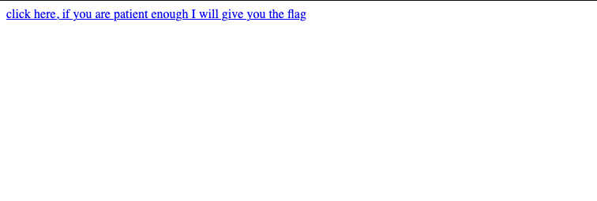
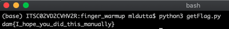

URL for challenge: [https://finger-warmup.chals.damctf.xyz/]
[https://finger-warmup.chals.damctf.xyz/]

For this challenge we're given access to a website that just looks like this:



Let's check out the HTML for the site as well:

```
<a href="un5vmavt8u5t5op1u94h">click here, if you are patient enough I will give
 you the flag</a>
```

Hmm, it looks like this goes to another page in the site. If we click on it
however, we'll see that we came across the same page. In fact, we can just 
keep clicking and going to different pages with no avail.

The challenged linked to two things 
([here][https://realpython.com/python-requests/] and 
[here][https://programminghistorian.org/en/lessons/intro-to-beautiful-soup]). 
One is how to send GET requests with python, and the other is a tutorial on 
how to use BeautifulSoup,a cool parser that can get information from HTML text 
for us.

Given these, and the challenge title, it looks like we will need to brute force 
through all of these links. The algorithm that I came up with goes as follows:

1. Send a GET request to the site to get the HTML (something I didn't know 
before you could do)
2. Parse through the HTML with beautiful soup. If a link exists, go back to step
1, this time with the new site URL. Otherwise, go to step 3
3. Print out the flag!

Here's the code that I wrote for getting the flag (also included in this folder)

```python
from bs4 import BeautifulSoup
import requests

baseURL = "https://finger-warmup.chals.damctf.xyz/"
code = ""

response = requests.get(baseURL)
soup = BeautifulSoup(response.text, 'html.parser')

link = soup.a
tryAgainText = link.text

while link:
    code = link.get('href')
    response = requests.get(baseURL+code)
    soup = BeautifulSoup(response.text, 'html.parser')
    link = soup.a

print(soup.pre.text)
```

When we run our code, we wait for a couple of ~~years~~ minutes...



Here is our flag!

```
dam{I_hope_you_did_this_manually}
```